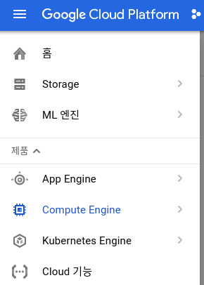
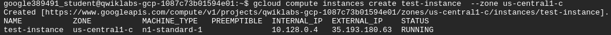
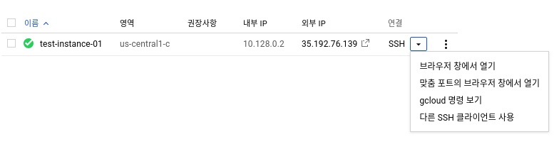

[TOC]

# Overview

Google Compute Engine을 사용하여 서로 다른 운영체제 (Debian, Ubuntu, Suse, Red Hat, CoreOS) 기반의 가상 머신을 생성할 수 있습니다. 

# Create VM Instance

## 콘솔에서 생성하기

먼저 Compute Engine 메뉴로 이동을 합니다. 



최초인 경우 다음의 화면이 보이게 됩니다.


`만들기`를 누르면 새로운 VM Instance를 생성할 수 있습니다.


캡쳐화면에서 볼 수 있듯이 `이름,` `영역 (Zone)` , `머신 유형, ` `부팅 디스크` 등등을 설정 할 수 있습니다.
`만들기` 버튼을 누른후 잠시 뒤 콘솔에서 생성된 인스턴스를 확인 할 수 있습니다.


## 명령어로  생성하기

예제로 다음과 같이 생성시킬 수 있습니다. 

```
gcloud compute instances create test-instance --zone us-central1-c
```




접속은 다음과 같이 합니다.

```
gcloud compute ssh test-instance --zone us-central1-c
```


# Instance에 접속 하기

## 콘솔에서 접속

아래의 화면에서 `SSH`를 누릅니다.



* 브라우저 창에서 열기를 하면.. 정말 손쉽게 브라우저 창에서 SSH로 연결이 바로 됩니다. 
* 개인적으로 `gcloud 명령 보기`를 누릅니다.
  * 누르면 명령어가 있는데 그대로 카피해서 terminal에 적으면 바로 연결이 됩니다.


## SSH로 접속

먼저 instance의 리스트를 출력합니다. 

```bash
gcloud compute instances list
```

[output]

```
NAME           ZONE           MACHINE_TYPE   PREEMPTIBLE  INTERNAL_IP  EXTERNAL_IP    STATUS
gcelab         us-central1-c  n1-standard-1               10.128.0.2   35.192.35.18   RUNNING
gcelab2        us-central1-c  n1-standard-1               10.128.0.3   35.188.64.84   RUNNING
test-instance  us-central1-c  n1-standard-1               10.128.0.4   35.193.180.63  RUNNING
```

test-instance에  **접속** 하려면 다음과 같이 합니다.

```
gcloud compute ssh test-instance --zone us-central1-c
```


# Persistent Disk 생성하기

## 생성및 설정

아마존의 EBS (Elastic Block Store)가 persistent block storage가 있듯이, GCP에서도 동일한 기능을 제공합니다. 

```
gcloud compute disks create mydisk --size=200GB --zone us-central1-c
```

GCE과 동일한 zone에 persistent disk를 생성해야 합니다. 
또는 VM Instance details 화면에서 변경이 가능합니다.


생성한 디스크를 virtual instance에 붙이도록 합니다.

```
gcloud compute instances attach-disk gcelab --disk mydisk --zone us-central1-c
```

만약 다른 이름으로 붙이고 싶다면,  `--device-name <YOUR_DEVICE_NAME>` 을 써서 바꿔줄수 있습니다.  
기본적으로 생성되는 이름은.. `scsi-0Google_PersistentDisk_persistent-disk-1` 입니다. 

확인을 위해서 먼저 SSH로 접속을 합니다.

```bash
gcloud compute ssh gcelab --zone us-central1-c
```

이후 disk devices를 리스트로 뽑아봅니다. 

```bash
ls -l /dev/disk/by-id/
```

`scsi-0Google_PersistentDisk_persistent-disk-1` 또는 설정한 이름으로 등록된 디바이스가 추가되어 있으면 문제없이 persistent disk를 분였다는 뜻입니다. 

## 포맷및 마운팅

먼저 mount point를 생성합니다. 

```
sudo mkdir /mnt/mydisk
```

포맷을 해줍니다. 

```
sudo mkfs.ext4 -F -E lazy_itable_init=0,lazy_journal_init=0,discard /dev/disk/by-id/scsi-0Google_PersistentDisk_persistent-disk-1
```

Mount시켜줍니다 

```
sudo mount -o discard,defaults /dev/disk/by-id/scsi-0Google_PersistentDisk_persistent-disk-1 /mnt/mydisk
```

## Restart시 자동으로 Mount시키기

`/etc/fstab` 을 vim으로 열어 줍니다. 

```
sudo vi /etc/fstab
```

`UUID=...` 로 시작하는 문장 다음에 다음을 집어 넣습니다. 

```
/dev/disk/by-id/scsi-0Google_PersistentDisk_persistent-disk-1 /mnt/mydisk ext4 defaults 1 1
```

저장하고 나오면.. restart때마다 자동으로 해당 persistent disk가 mount되게 됩니다. 

## Local SSD

실제 물리적인 디스크를  virtual machine에 물리적으로 붙일수도 있습니다. 
이 경우 Local SSDs를 사용하게 되며, 다음의 이점이 있습니다.

* 1ms 보다 적은 latency
* 680,000 read IOPs
* 360,000 write IOPs

퍼포먼스 측면에서는 뛰어나나, 관리적 측면 또는 데이터 손실에 있어서 위험이 있습니다. 
자세한 내용은 [링크](https://cloud.google.com/compute/docs/disks/local-ssd#create_a_local_ssd)를 확인합니다.


