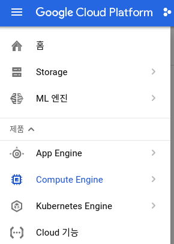
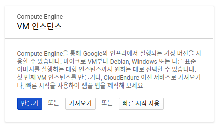
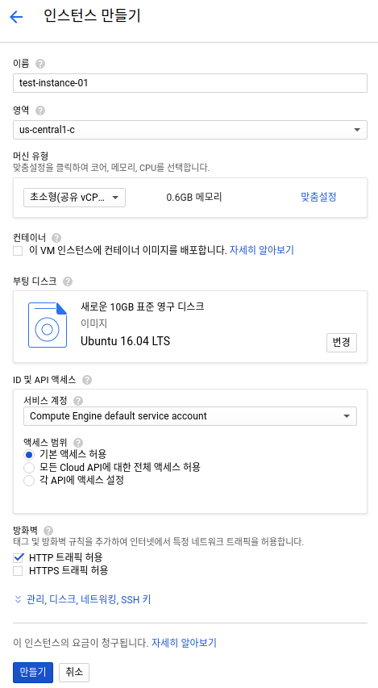
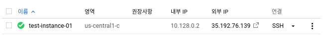
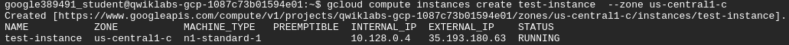
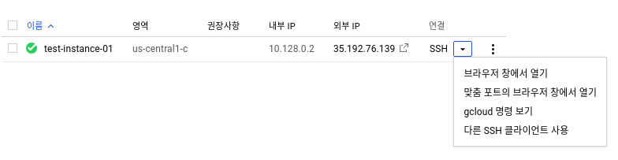
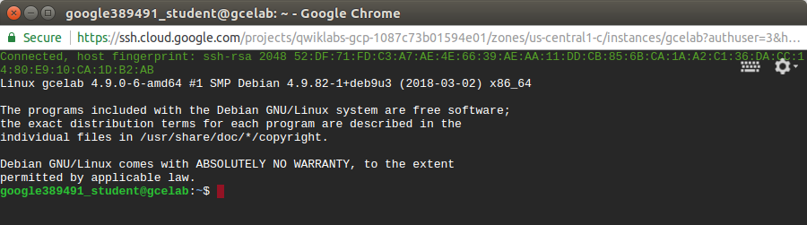

[TOC]

# Overview

Google Compute Engine을 사용하여 서로 다른 운영체제 (Debian, Ubuntu, Suse, Red Hat, CoreOS) 기반의 가상 머신을 생성할 수 있습니다. 

# Create VM Instance

## 콘솔에서 생성하기

먼저 Compute Engine 메뉴로 이동을 합니다. 



최초인 경우 다음의 화면이 보이게 됩니다.



`만들기`를 누르면 새로운 VM Instance를 생성할 수 있습니다.



캡쳐화면에서 볼 수 있듯이 `이름,` `영역 (Zone)` , `머신 유형, ` `부팅 디스크` 등등을 설정 할 수 있습니다.
`만들기` 버튼을 누른후 잠시 뒤 콘솔에서 생성된 인스턴스를 확인 할 수 있습니다.



## 명령어로  생성하기

예제로 다음과 같이 생성시킬 수 있습니다. 

```
gcloud compute instances create test-instance --zone us-central1-c
```




접속은 다음과 같이 합니다.

```
gcloud compute ssh test-instance --zone us-central1-c
```


# Instance에 접속 하기

## 콘솔에서 접속

아래의 화면에서 `SSH`를 누릅니다.



* 브라우저 창에서 열기를 하면.. 정말 손쉽게 브라우저 창에서 SSH로 연결이 바로 됩니다. 
* 개인적으로 `gcloud 명령 보기`를 누릅니다.
  * 누르면 명령어가 있는데 그대로 카피해서 terminal에 적으면 바로 연결이 됩니다.



## SSH로 접속

먼저 instance의 리스트를 출력합니다. 

```bash
gcloud compute instances list
```

[output]

```
NAME           ZONE           MACHINE_TYPE   PREEMPTIBLE  INTERNAL_IP  EXTERNAL_IP    STATUS
gcelab         us-central1-c  n1-standard-1               10.128.0.2   35.192.35.18   RUNNING
gcelab2        us-central1-c  n1-standard-1               10.128.0.3   35.188.64.84   RUNNING
test-instance  us-central1-c  n1-standard-1               10.128.0.4   35.193.180.63  RUNNING
```

test-instance에  **접속** 하려면 다음과 같이 합니다.

```
gcloud compute ssh test-instance --zone us-central1-c
```

