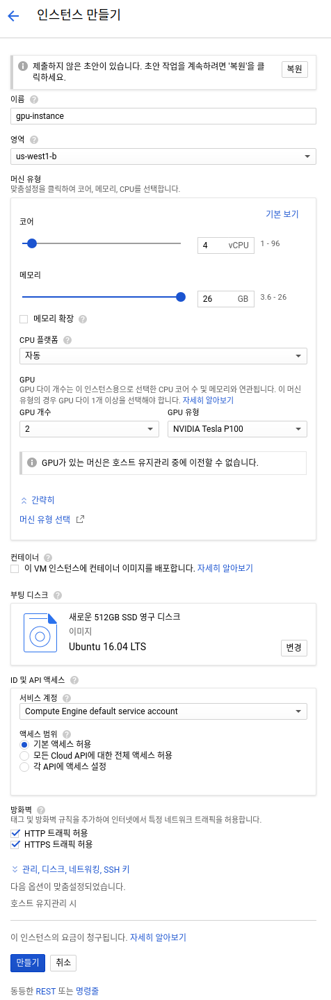
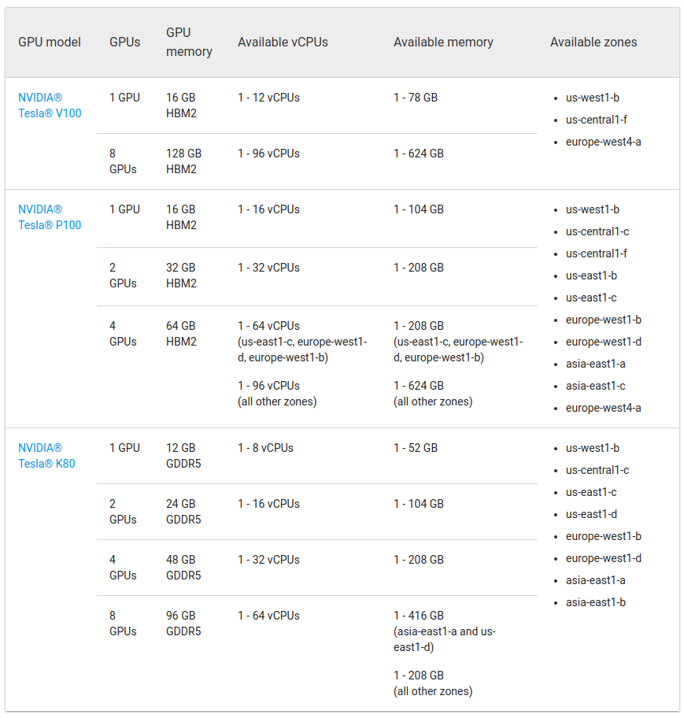

[TOC]

# GPU Instance 생성하기

아래와 같이 Instance를 생성합니다.



GPU 가 지원되는 특정 지역에서만 지원이 되고 있습니다. 

[링크](https://cloud.google.com/compute/docs/gpus/)를 에서 지원되는 지역을 참고 합니다. 



# CUDA 설치

[구글 클라우드 GPU 등록하기](https://cloud.google.com/compute/docs/gpus/add-gpus) 문서에 나와 있는 그대로 CUDA를 설치합니다.
NVIDIA에서 문서에 나와있지 않는 드라이버를 설치시 나중에 설치가 되지 않을 것입니다. 
정확하게 문서에 나온 그대로의 버젼을 설치해야 합니다. 

```bash
$ curl -O http://developer.download.nvidia.com/compute/cuda/repos/ubuntu1604/x86_64/cuda-repo-ubuntu1604_9.0.176-1_amd64.deb
$ sudo dpkg -i cuda-repo-ubuntu1604_9.0.176-1_amd64.deb
$ sudo apt-key adv --fetch-keys http://developer.download.nvidia.com/compute/cuda/repos/ubuntu1604/x86_64/7fa2af80.pub
$ sudo apt-get update
$ sudo apt-get install cuda-9-0
$ sudo nvidia-smi -pm 1
```

`nvidia-smi` 명령어를 통해서 설치가 잘 되었는지 확인합니다.
설치가 잘되었다면 아래와 같이 나와야 합니다. 

```
anderson@instance-1:~$ nvidia-smi
Sat May 12 11:32:10 2018       
+-----------------------------------------------------------------------------+
| NVIDIA-SMI 390.30                 Driver Version: 390.30                    |
|-------------------------------+----------------------+----------------------+
| GPU  Name        Persistence-M| Bus-Id        Disp.A | Volatile Uncorr. ECC |
| Fan  Temp  Perf  Pwr:Usage/Cap|         Memory-Usage | GPU-Util  Compute M. |
|===============================+======================+======================|
|   0  Tesla K80           On   | 00000000:00:04.0 Off |                    0 |
| N/A   44C    P0    57W / 149W |      0MiB / 11441MiB |      0%      Default |
+-------------------------------+----------------------+----------------------+
|   1  Tesla K80           On   | 00000000:00:05.0 Off |                    0 |
| N/A   42C    P0    61W / 149W |      0MiB / 11441MiB |      0%      Default |
+-------------------------------+----------------------+----------------------+
|   2  Tesla K80           On   | 00000000:00:06.0 Off |                    0 |
| N/A   61C    P0    73W / 149W |      0MiB / 11441MiB |      0%      Default |
+-------------------------------+----------------------+----------------------+
|   3  Tesla K80           On   | 00000000:00:07.0 Off |                    0 |
| N/A   41C    P0    57W / 149W |      0MiB / 11441MiB |      0%      Default |
+-------------------------------+----------------------+----------------------+
                                                                               
+-----------------------------------------------------------------------------+
| Processes:                                                       GPU Memory |
|  GPU       PID   Type   Process name                             Usage      |
|=============================================================================|
|  No running processes found                                                 |
+-----------------------------------------------------------------------------+

```

