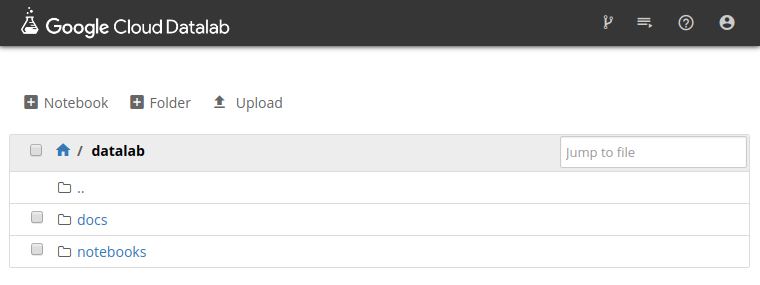

# Setting up Cloud Datalab

## Before you begin

1. Google Cloud Platform 콘솔에서 프로젝트를 생성 또는 선택
2. 해당 프로젝트의 billing을 설정
3. `Google Compute Engine` 그리고 `Cloud Source Repository` API 를 enable시킨다

## Installation

업데이트후 `datalab`을 설치합니다.

```
gcloud components update
gcloud components install datalab
```

설치후 `gcloud components list` 명령어를 통해 설치 된 components를 확인 할 수 있습니다.

## Creating Datalab Instance

```
datalab create [datalab-instance-name]
```

만약 K80 GPU 를 갖은 Cloud Datalab VM 을 생성하고자 하면 다음과 같이 합니다.

> Multi GPUs 를 사용할때는 `--accelerator-count [number]` flag를 사용

```
datalab beta create-gpu [datalab-instance-name]
```

생성까지 조금 시간이 걸리며, 생성완료된후 `localhost:8081` 같은 주소로 접속이 가능합니다. 




## Cleaning Up Datalab Instance

생성된 Datalab에 대한 자원을 종료를 해줍니다. (cleaning up을 안 할 경우 비용이 추가적으로 나올 수 있습니다.) Datalab VM instance의 생성부터 종료까지 비용이 발생하게 되며, notebooks이 저장되어 있는 persistent disk에 대해서도 비용이 발생합니다. 

다음의 명령어는 **Datalab Instance** 그리고 **Persistent Disk**  모두 제거합니다. 

> `datalab list` 를 통해서 instances를 확인 가능합니다.

```
datalab delete --delete-disk [instance-name]
```

## Uncertain yet

1. 일단 Datalab에서 `!pip3 install ~.whl` 을 사용해서 pytorch 설치가 안된다. 해당 플랫폼에서 지원하지 않는 파일이라고 나오면서 설치가 안된다. 다만 Datalab이 Google Compute Engine에 기반하고 있기 때문에 Compute Engine에 집접 접속해서 설치하면 되지 않을까 생각이 든다.