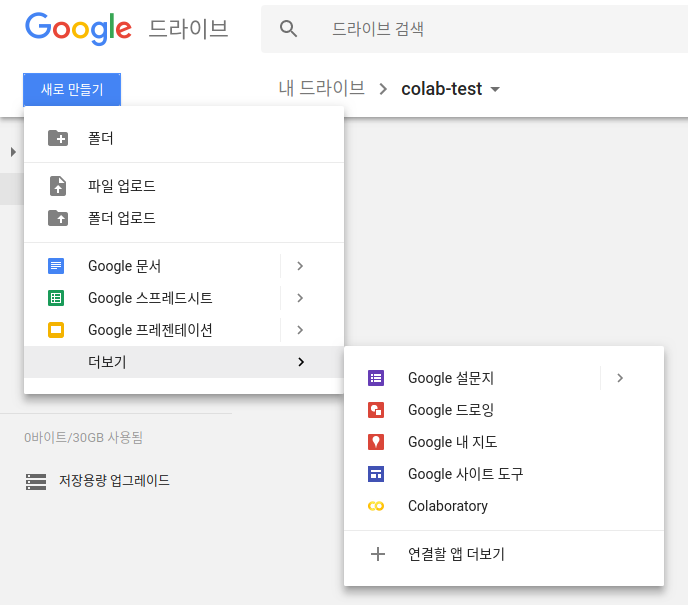

# Google Colaboratory 

Google Colaboratory 를 사용해서 딥러닝 모델을 구현할수 있습니다.
Tesla K80 GPU를 무료로 사용가능하며, Keras, TensorFlow, 그리고 Pytorch 사용이 가능합니다.

## Creating New Colab Notebook

구글 Colab은 Google Drive에서 사용이 가능합니다. 
`새로 만들기` -> `더보기` -> `Colaboratory` 를 누름으로서 생성할수 있습니다.

> 생성까지 다소 시간이 걸립니다. 그동안에 트와이스 보고 있으면 됩니다.
> `Colaboratory` 버튼이 안보이면 `연결할 앱 더보기`를 눌러서 설치합니다.




## Installing Pytorch

```
!pip3 install http://download.pytorch.org/whl/cu80/torch-0.3.0.post4-cp36-cp36m-linux_x86_64.whl 
!pip3 install torchvision
``` 

아래의 코드로 잘 되는지 확인해 봅니다.
```
import torch
from torch.autograd import Variable

a = Variable(torch.cuda.FloatTensor([[1, 2, 3], [0, 1, 1], [1, 0, 3]]))
b = Variable(torch.cuda.FloatTensor([[1, 0, 4], [1, 5, 3], [2, 3, 0]]))
%time a.matmul(b) # a @ b
```

## Installing Keras

```
!pip3 install keras
```

# 전반적인 의견

Colab은 내부동작은 당연히 빠르다. 
하지만 네트워크의 문제로 체감상은 인터랙티브가 느리게 느껴진다.
또한 아직 부족한 인터페이스는 실무연구원에게는 매우 답답하게 느껴졌다.

따라서 대부분의 작업은 local에서 하고, 실제 학습은 colab에서 하는 것이 좋을 것 같다. 딥러닝의 특성상 hyperparameter optimization이 중요한데 이때 이용하면 효율적으로 일 할 수 있다.