[TOC]


# Google Kubernetes 이란?

[Kubernetes](http://kubernetes.io/)은 오픈 소스 프로젝트로서 컨테이너같은 서비스를 제공합니다. 


# Tutorial

해당 튜토리얼은 Google Cloud shell에서 진행을 할 수 있습니다. 


## Node.js 애플리케이션 만들기

먼저 server.js 에다가 아주 기본적인 스크립트를 작성합니다. 

```
vi server.js
```

아래와 같이 작성을 합니다. 

```
var http = require('http');
var handleRequest = function(request, response) {
  response.writeHead(200);
  response.end("Hello World!");
}
var www = http.createServer(handleRequest);
www.listen(8080);
```

서버를 실행시킵니다.

```
node server.js
```

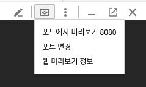

미리보기 버튼을 누르면 Hello World! 가 찍히는 것을 볼 수 있습니다.


## Docker Container Image 만들기

```
vi Dockerfile
```

내용은 다음과 같습니다.

```
FROM node:6.9.2
EXPOSE 8080
COPY server.js .
CMD node server.js
```

**Docker image를 생성**합니다. 이때 `PROJECT_ID`는 `gcloud projects list` 로 확인 할 수 있습니다. 

```
docker build -t gcr.io/PROJECT_ID/hello-node:v1 .
```

생성한 **docker container를 실행**시켜서 제대로 작동하는지 확인해 볼 수 있습니다.

```
docker run -d -p 8080:8080 gcr.io/PROJECT_ID/hello-node:v1
```

docker images 그리고 processor를 확인합니다. 

```
docker images
docker ps -a
```

프리뷰 버튼을 눌러서 확인합니다.


curl 을 통해서도 확인이 가능합니다. 

```
curl http://localhost:8080
```

돌아가는 것을 확인했으니 **중지**시킵니다. 

```bash
$ docker ps -a
CONTAINER ID        IMAGE                         COMMAND                  CREATED             STATUS              PORTS                    NAMES
a3cae6681914        gcr.io/xmdw33/hello-node:v1   "/bin/sh -c 'node ..."   5 minutes ago       Up 5 minutes        0.0.0.0:8080->8080/tcp   stupefied_cori

$ docker stop stupefied_cori
```

작동하는 것을 확인했으니, [Google Container Registry](https://cloud.google.com/container-registry/) 로 보냅니다. Google Container Registry는 docker images를 위한 private repository 로서 google cloud projects에서 접근이 가능합니다. 

```
gcloud docker -- push gcr.io/PROJECT_ID/hello-node:v1
```

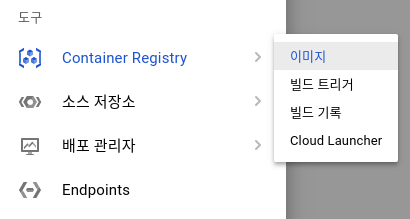

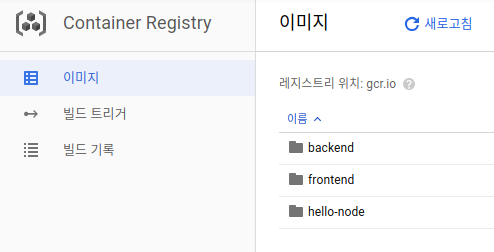

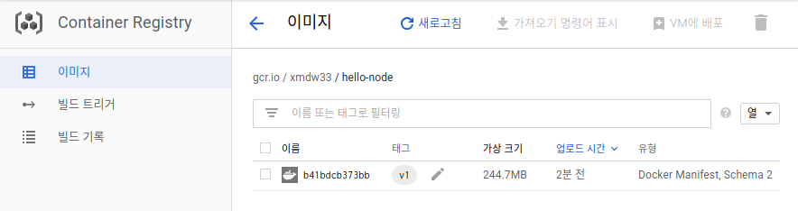

명령어에서도 확인할 수 있습니다.

```bash
$ gcloud container images list
NAME
gcr.io/qwiklabs-gcp-8bba0513ed0c0ffd/hello-node
```


## Container Engine Cluster 생성하기

Cluster는 master API server 그리고 여러개의 worker nodes로 이루어져 있으며, worker nodes는 Compute Engine  의 가상 머신이라고 생각하면 됩니다. 

아래의 명령어는 두개의 [n1-standard-1](https://cloud.google.com/compute/docs/machine-types) 노드를 생성합니다.  (몇분이 걸립니다)

```bash
gcloud container clusters create hello-world --num-nodes 2 --machine-type n1-standard-1 --zone us-central1-f
```

**확인**은 다음과 같이 합니다.

```bash
gcloud container clusters list
gcloud container images list
```

콘솔에서 Kubernetes Cluster를 확인할 수 있습니다. 

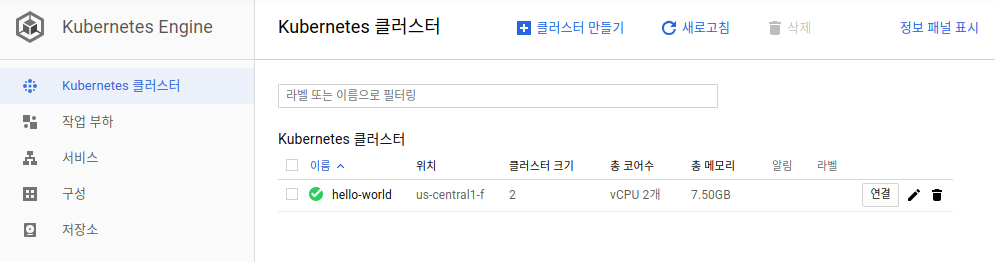

2개 생성한 nodes는 Compute Engine에서 확인 할 수 있습니다. 

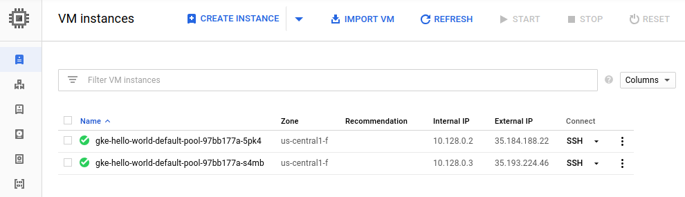


## Pod 생성하기 

Kubernetes Pod는 containers 그룹으로서 **관리** 및 **네트워크** 목적을 갖고 있으며, **하나 또는 다수의 containers를 갖고 있을 수 있습니다.** 

먼저 이미지를 확인합니다.

```bash
$ gcloud container images list
NAME
gcr.io/xmdw33/backend
gcr.io/xmdw33/frontend
gcr.io/xmdw33/hello-node
Only listing images in gcr.io/xmdw33
```

아래의 명령어는 deployments object를 생성합니다. 

```bash
$ kubectl run hello-node --image=gcr.io/PROJECT_ID/hello-node:v1 --port=8080
deployment "hello-node" created
```

생성된 **deployments를 확인**합니다. 

```bash
$ kubectl get deployments
NAME          DESIRED   CURRENT   UP-TO-DATE   AVAILABLE   AGE
hello-world   1         1         1            1           17m
```

생성된 **pods도 확인**합니다.

```bash
$ kubectl get pods
NAME                          READY     STATUS    RESTARTS   AGE
hello-world-96db85b94-lvxwr   1/1       Running   0          19m
```

**cluster info** 확인합니다. 

```bash
kubectl cluster-info 
```

설정확인은 다음과 같이 합니다.

```
kubectl config view
```

혹시 잘못 만들어서 삭제시 다음과 같이 합니다.

```
kubectl delete deployment hello-world
```


## 외부접속 설정 

Pod까지 생성을 했습니다. 하지만 Pod은 오직 내부 IP에서만 접속이 가능합니다.  `hello-node` container를 kubernete virtual network**밖에서 접속이 가능하도록 만들려면 pod을 Kubernetes service로 만들어야 합니다**. 

먼저 deployments를 확인합니다.

```bash
$ kubectl get deployments
NAME         DESIRED   CURRENT   UP-TO-DATE   AVAILABLE   AGE
hello-node   1         1         1            1           9m
```

**expose시킵니다.**

```bash
$ kubectl expose deployment hello-node --type="LoadBalancer" --port 8080
service "hello-node" exposed
```

LoadBalancer 옵션은 [Compute Engine에서 제공하는 Load Banaler](https://cloud.google.com/compute/docs/load-balancing/) 를 사용하겠다는 뜻이며, Pod을 집접적으로 expose시키는 대신에 deployment 를 expose시켰습니다. 

**publicly-accessible IP 주소를 확인**하기 위해서 다음과 같이 합니다.

```bash
$ kubectl get services
NAME         TYPE           CLUSTER-IP    EXTERNAL-IP      PORT(S)          AGE
hello-node   LoadBalancer   10.3.246.84   35.184.230.137   8080:31574/TCP   3m
kubernetes   ClusterIP      10.3.240.1    <none>           443/TCP          1h
```

External-IP로 써져있는 35.184.230.137:8080 으로 접속시 Hello World! 를 확인 할 수 있습니다.

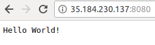

## Service를 Scale Up 하기

Kubernete의 장점중의 하나는 scaling up 그리고 down이 매우 쉽다는 것 입니다. 

아래의 명령어는 해당 pod에 대한 **replicas를 생성**하도록 합니다. 
(이미 2개가 생성되어 있었으니 2개가 추가로 생성이 됩니다. )

```
kubectl scale deployment hello-node --replicas=4
```

deployment를 확인합니다.

```bash
$ kubectl get deployment
NAME         DESIRED   CURRENT   UP-TO-DATE   AVAILABLE   AGE
hello-node   4         4         4            4           29m
```

Pods 도 확인합니다.

```bash
$ kubectl get pods
NAME                         READY     STATUS    RESTARTS   AGE
hello-node-cf99b4b9d-kqm8b   1/1       Running   0          32m
hello-node-cf99b4b9d-qbml5   1/1       Running   0          8m
hello-node-cf99b4b9d-v65zt   1/1       Running   0          8m
hello-node-cf99b4b9d-xws6r   1/1       Running   0          8m
```


## Roll Out 하기

hello-world 라는 node.js 서버를 만들고 디플로이까지 시켰습니다. 실제 운영중에는 버그픽스도 필요하고 새로운 피쳐를 롤아웃 할때도 있습니다. Kubernetes은 새로운 버젼을 production으로 디플로이 하도록 도와줍니다. 

먼저 node.js 앱에 대한 수정을 합니다. 

```
vi server.js
```

아래와 같이 수정합니다.

```
response.end("Hello Kubernetes World!");
```

새로운 container image를 생성하고 registry에 등록합니다.
`gcloud container images list` 를 통해서 이미지 정보를 얻을 수 있습니다. 

```
docker build -t gcr.io/PROJECT_ID/hello-node:v2 . 
gcloud docker -- push gcr.io/PROJECT_ID/hello-node:v2
```

새로운 애플리케이션으로 업데이트하기 위해서 기존의 `hello-node deployment`에서 `gcr.io/PROJECT_ID/hello-node:v1` 을 `gcr.io/PROJECT_ID/hello-node:v2` 으로 수정해줘야 합니다. (수정후 바로 자동으로 적용이 됩니다)

```bash
$ kubectl edit deployment hello-node
deployment "hello-node" edited
```

수정후 몇분뒤 천천히 roll out이 진행이 됩니다. 

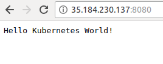


## Kubernetes Graphical Dashboard

GCP에서 Kubernetes clusters로 이동한뒤 `connect`버튼을 찾아서 누룹니다.

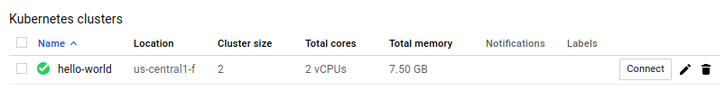

Command-line access 에서 해당 명령어를 복사합니다.

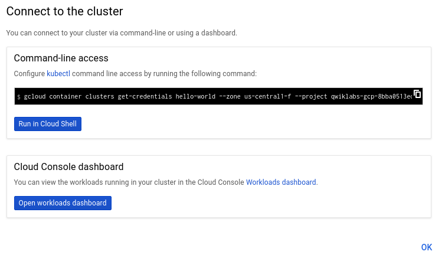

```bash
gcloud container clusters get-credentials hello-world --zone us-central1-f --project qwiklabs-gcp-8bba0513ed0c0ffd
```

대쉬보드에 접속하기 위해서는 token을 사용해서 authenticate를 해야 합니다.

```
kubectl -n kube-system describe $(kubectl -n kube-system get secret -n kube-system -o name | grep namespace) | grep token:
```

8081포트로 변환해서 대쉬보드를 킵니다.

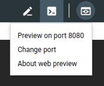

`?authuser=0`을 지우고 `/ui`를 추가시켜서 URL을 만듭니다.
아래는 예제 입니다.

```
https://8081-dot-3839902-dot-devshell.appspot.com/ui
```

아래의 화면에서 Token을 선택하고, 이전에 얻은 Token값을 복사해서 넣습니다. 

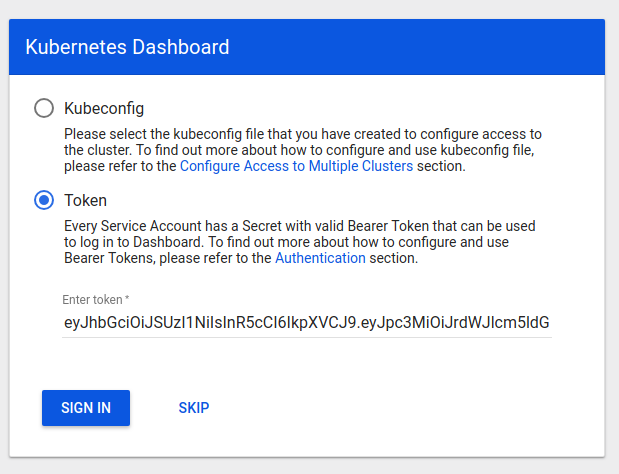

최종적으로 다음과 같은 화면을 볼 수 있습니다.

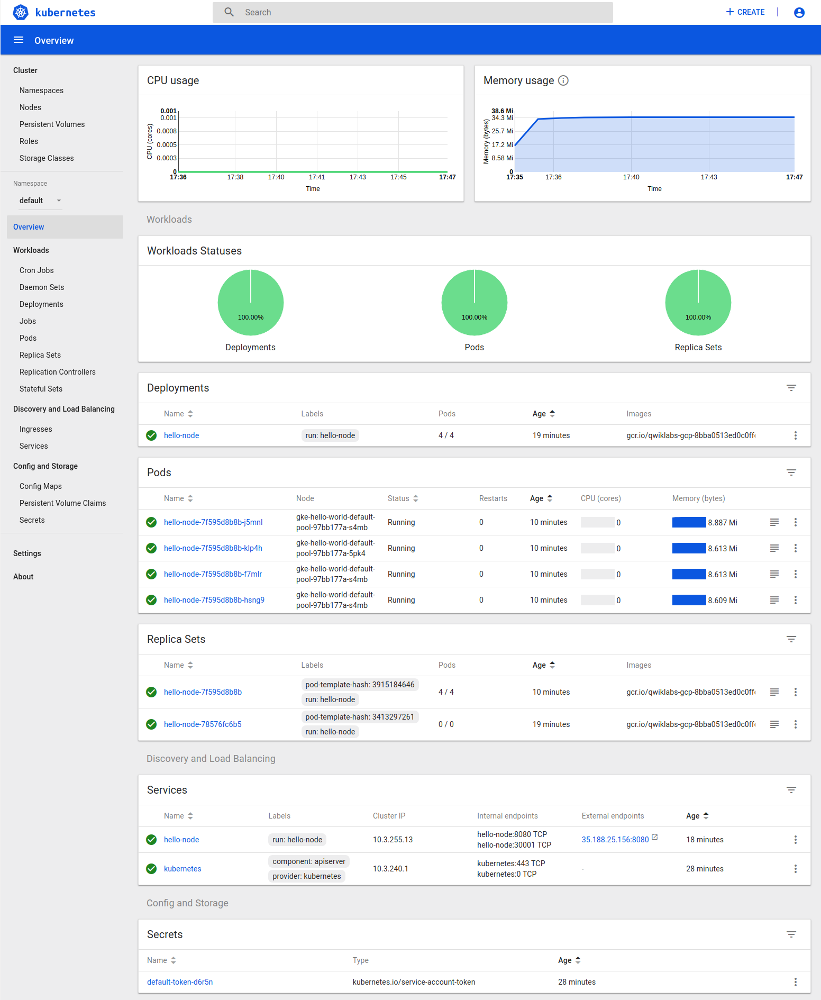

