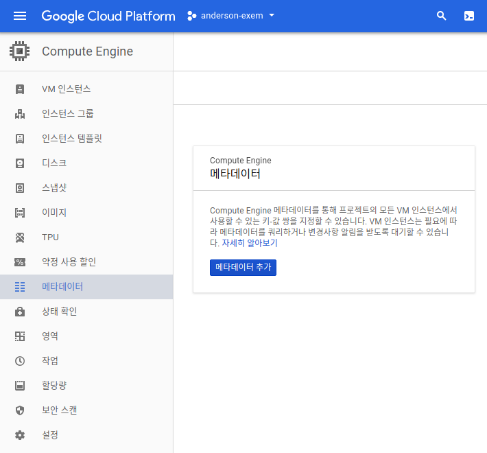
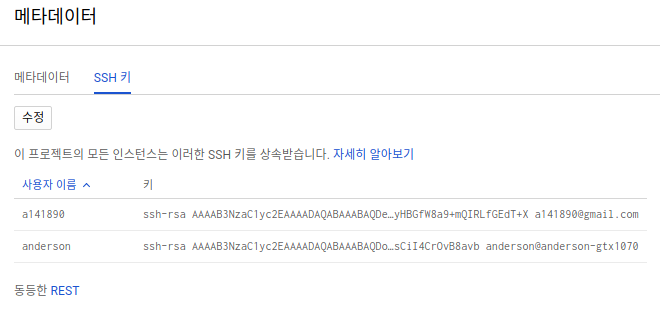
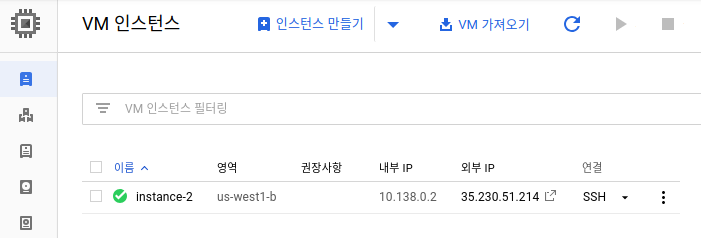
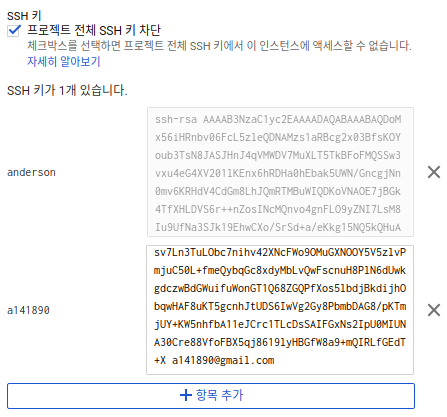

[TOC]

# Overview

SSH Keys를 생성 그리고 관리를 통해서 [third-party tools](https://cloud.google.com/compute/docs/instances/connecting-advanced#thirdpartytools)을 통해서 접속을 할 수 있습니다. 
SSH Key는 2가지 파일로 구성이 되어 있습니다.

- Public SSH Key file 
- Private SSH Key file

사용자는 private ssh key를 사용해서, public ssh key를 갖고 있는 인스턴스에 접속할 수 있습니다.  이때 Cloud Platform project의 맴버가 아니어도 접속이 가능해집니다.  따라서 어떤 유저가 접속할지 관리하는 것은 전적으로 public ssh key metadata를 관리함으로서 컨트롤 할 수 있습니다. 


# 새로운 SSH Key 생성하기 

만약 기존의 private SSH key file이 존재하지 않다면 다음의 방법으로 생성할 수 있습니다. 

먼저 local 환경에서 terminal을 열고 새로운 키를 생성합니다. 

```bash
ssh-keygen  -t rsa -f ~/.ssh/[KEY_FILENAME] -C [USERNAME]
chmod 400 ~/.ssh/[KEY_FILENAME]
```

예를 들어서 다음과 같이 만들수 있습니다 .

```
ssh-keygen  -t rsa -f ~/.ssh/gcp -C "a141890@gmail.com"
chmod 400 ~/.ssh/gcp
```


# GCP에 SSH Key 등록하기

3가지 방식의 메타데이터가 있으며, 이를 통해서 접속을 컨트롤 할 수 있습니다.

1. **[Project-wide public SSH keys](https://cloud.google.com/compute/docs/instances/adding-removing-ssh-keys#project-wide)**: 프로젝트의 모든 인스턴스에 접속할수 있도록 합니다. 
2. [**Allow or Block project-wide public SSH keys**](https://cloud.google.com/compute/docs/instances/adding-removing-ssh-keys#block-project-keys): 특정 인스턴스만 project-wide public ssh key를 통해서 접근을 못하도록 막을 수 있습니다. 
3. [**Instance-level public SSH keys**](https://cloud.google.com/compute/docs/instances/adding-removing-ssh-keys#instance-only): 특정 인스턴스에만 특정 public ssh key 설정합니다. 

## project-wide public SSH Keys 설정하기

먼저 `Compute Engine`에서 `메타데이터` 를 선택합니다. 



`메타데이터 추가`를 누른 후 `SSH 키` 메뉴를 누르면 여기서 public 키를 등록시킬 수 있습니다.



등록후 모든 인스턴스에 접속이 가능해집니다. 

## Project-wide Public Key 접속 막기

기본적으로 위에서 project-wide public key를 설정하면 모든 인스턴스에 접속이 가능해집니다. 
하지만 특정 인스턴스는 막고 싶다면 다음과 같이 하면 됩니다. 

먼저 Compute Engine에서 `VM 인스턴스` 메뉴를 선택후 막고자 하는 인스턴스를 선택합니다. 



캡쳐화면에서 `instance-2`가 있는데 선택후 `수정 `버튼을 눌러서 인스턴스 정보를 수정합니다. 

수정 화면에서 다음과 같은 체크박스표시가 있습니다. 


체크박스를 선택하면 project-wide public key를 통해서 해당 인스턴스에는 들어갈수 없게 됩니다. 

## 특정 Instance에 메타데이터 설정하기

위의 접속막기와 마찬가지로 Compute Engine에서 `VM 인스턴스` 선택후 `수정`을 누릅니다. 

SSH 키에서 추가하면 끝.



# 접속하기

```
ssh -i ~/.ssh/gcp [IP]
```


