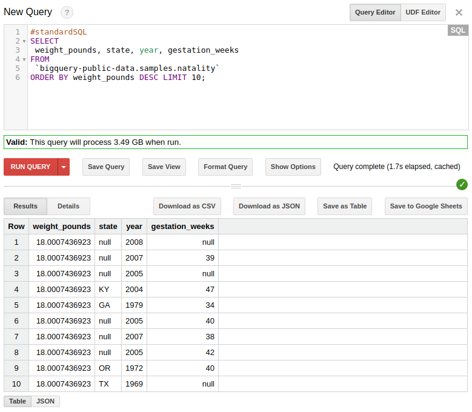
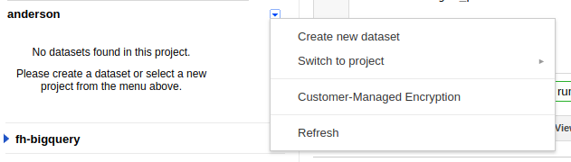
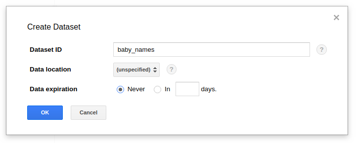
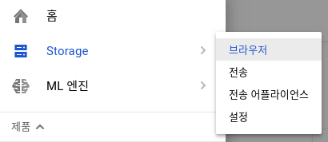
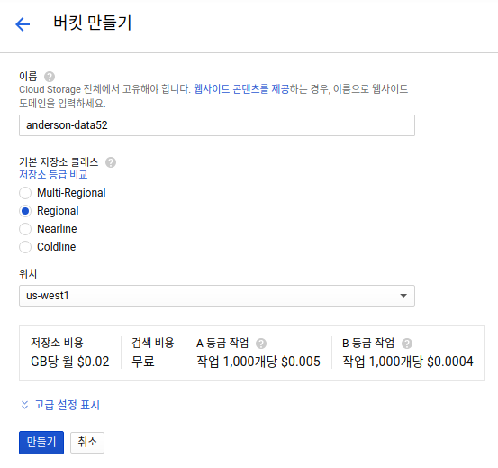
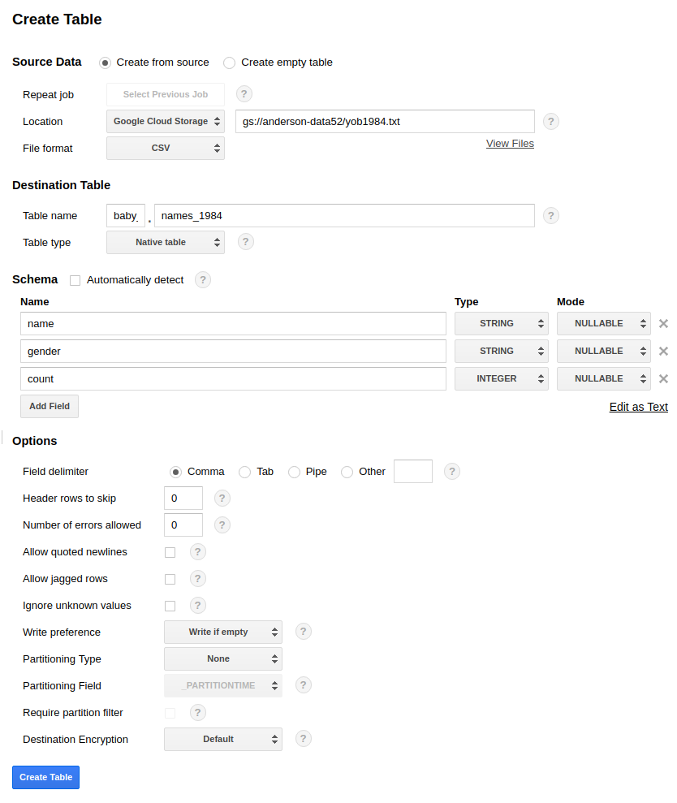
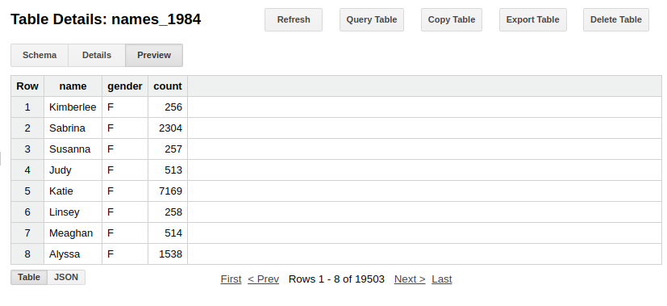

# Overview 

BigQuery는 대규모 데이터셋을 SQL query를 통하여 다루도록 도와줍니다. 


# Tutorial

## Query a public dataset

BigQuery는 [public dataset](https://cloud.google.com/bigquery/public-data/)을 제공하고 있습니다.  해당 공개된 데이터를 통해서 튜토리얼을 진행할 수 있습니다. 

BigQuery -> Compose Query 를 선택한후 다음과 query를 실행시킵니다.

```
#standardSQL
SELECT
 weight_pounds, state, year, gestation_weeks
FROM
 `bigquery-public-data.samples.natality`
ORDER BY weight_pounds DESC LIMIT 10;
```



## 외부 데이터 불러오기

먼저 BigQuery에서 데이터셋을 생성합니다. 
데이터셋은 여러개의 테이블을 갖고 있는 것으로서 RDBMS의 DB와 같은 개념입니다. 



Dataset ID는 baby_names로 생성을 합니다. 



그 다음 Cloud Shell에서 데이터를 다운 받습니다.

```
mkdir names
cd names
wget http://www.ssa.gov/OACT/babynames/names.zip
unzip names.zip
```

Storage -> Create Bucket을 눌러서 데이터를 cloud로 올립니다.



이름에는 unique한 이름이 들어가야 합니다.



아래의 명령어를 이용해서 Google Cloud Storage에 데이터를 올립니다. 

```
gsutil cp yob1984.txt gs://anderson-data52
```

BigQuery로 돌아와서 Cloud Storage에 올라온 데이터를 BigQuery로 가져옵니다.

데이터셋 baby_names에서 + 버튼을 눌러서 테이블을 생성합니다. 



Preview를 눌러서 대략적인 데이터 내용을 확인할 수 있습니다.



쿼리는 다음과 같이 할 수 있습니다.

```
#standardSQL
SELECT
 name, count
FROM
 `baby_names.names_1984`
WHERE
 gender = 'M'
ORDER BY count DESC LIMIT 5;
```

