[TOC]

# Overview

Google Cloud Dataprep은 분석을 하기전 데이터 탐색, 정제, 전처리등등을 시각적으로 실행할 수 있는데 서비스입니다. Cloud Dataprep은 serverless이며 데이터 이외의 관리할 인프라스트럭쳐가 없습니다. 오직 데이터 전처리에만 신경쓰면 됩니다. 또한 코드도 존재하지 않으며 단지 마우스 클릭 몇번으로 모든 일이 처리 될 수 있습니다. 

# 튜토리얼

## 준비

1. Cloud Storage에서 데이터를 저장할 bucket을 만듭니다.
2. GCP -> Dataprep 선택후 Trifacta가 프로젝트에 접근할수 있도록 허용하도록 합니다. 
   (Dataprep은 Trifacta와 구글과 긴밀하게 협력하여 제공되는 서비스입니다.)

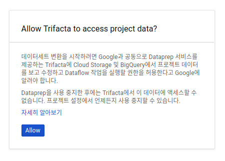

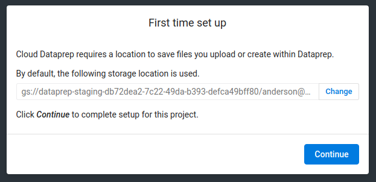

## Flow 생성하기

위의 과정을 지나면 다음과 같은 화면이 보입니다.

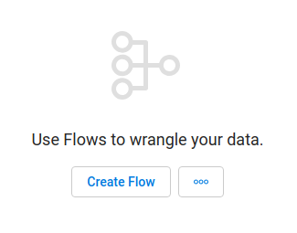

Tutorial에서는 [Federal Eletions Commision 2016 ](http://classic.fec.gov/finance/disclosure/ftpdet.shtml#a2015_2016)데이터를 사용하기 때문에 이름을 `FEC-2016`이라고 지어 줍니다.

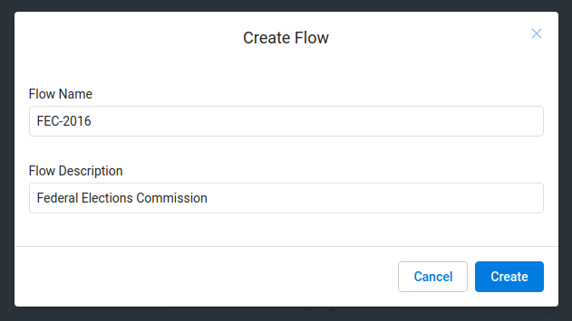

## 데이터 불러오기

FEC-2016 Flow에서 `Import & Add Datasets` 을 선택합니다. 

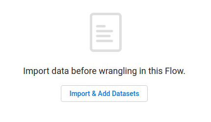

파일을 선택한 후 `Import`를 누릅니다.

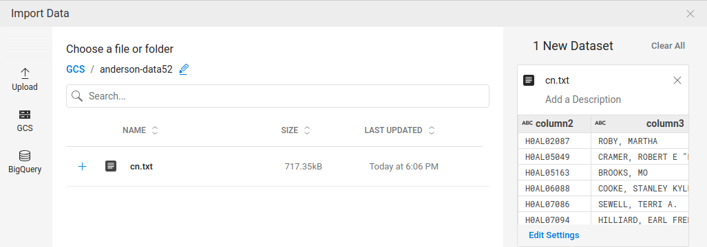

## 데이터 전처리하기

등록한후, `Add new Recipe`을 누릅니다. 

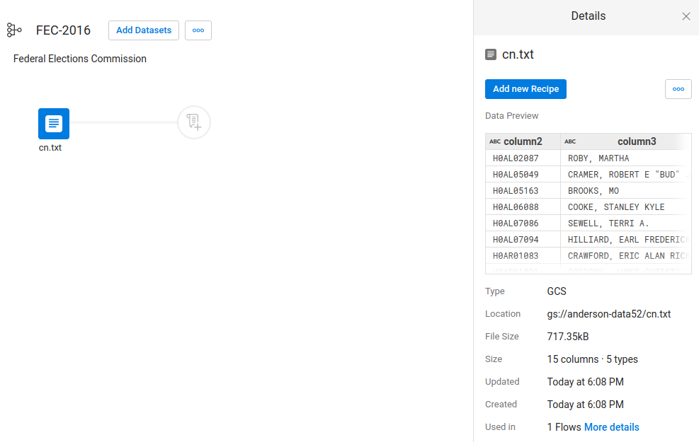

`Edit Recipe`을 선택합니다. 

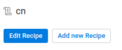

Grid view 화면이 열립니다. 여기에서 데이터 탐색및 변환을 수행할 수 있습니다. 

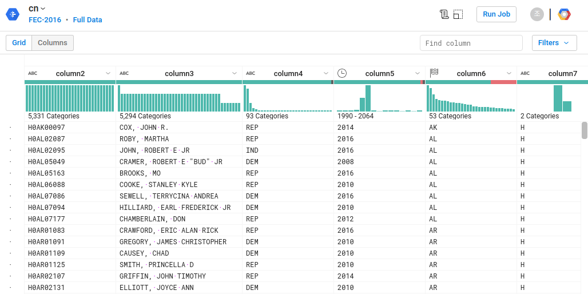

먼저 Column5를 보면 1990부터 2064년까지의 년도가 지정되어 있습니다. 
필요한 데이터가 2016년 1월 1일 부터 2018년 1월 1일 전까지라고 가정했을때, 히스토그램에서 2016년 2017년을 포함하는 드래그해서 선택을 합니다. 

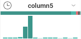

드래그로 선택하고 난뒤 어떻게 처리할지 suggestions을 해줍니다. 

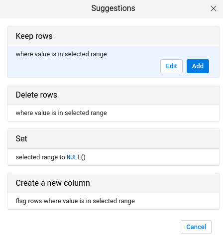

Edit을 눌러서 2016년 1월 1일부터, 2018년 1월 1일전까지로 설정을 합니다. 

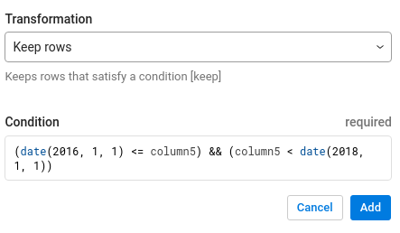

Add를 누르고 나면 데이터는 2016년, 2017년 데이터만 남게 됩니다. 

이번에는 Column6의 mismatched values를 선택합니다. 

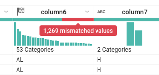

화면 아래쪽의 `Show only affected`에서 `rows` 체크버튼을 클릭합니다. 

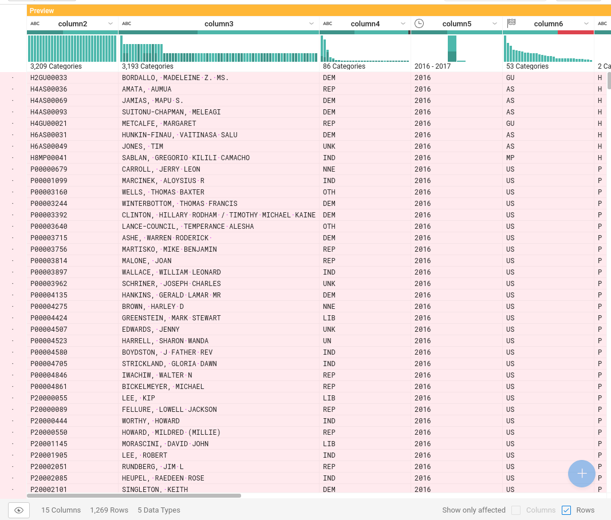

Column6에 mismatched values가 생겨나게 된 이유는, 데이터 타입이 state이기 때문입니다. 하지만 mismatched values로 지정된 데이터를 보면 미국 주가 아닌 US로 되어 있는게 대부분입니다. 

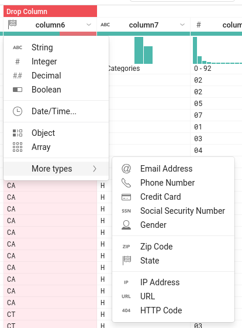

mismatched를 해결하기 위해서는 Column6 오른쪽에 있는 깃발(주를 상징)을 클릭후 String으로 변환해줍니다.

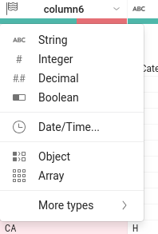

