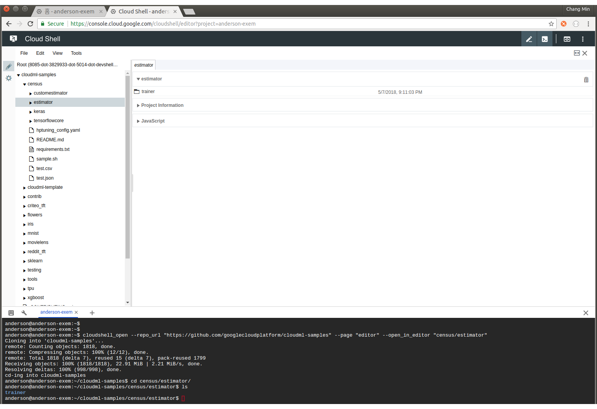
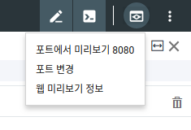
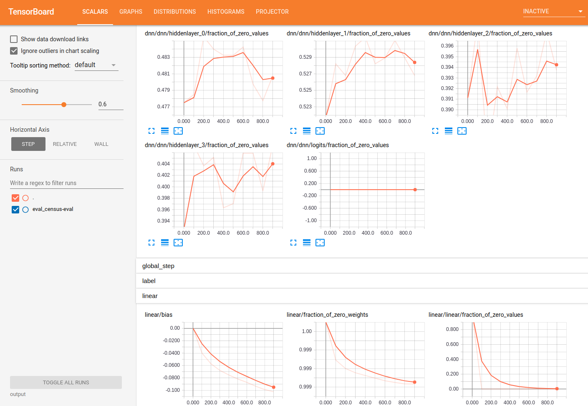
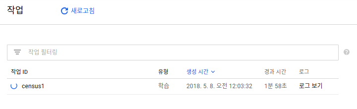
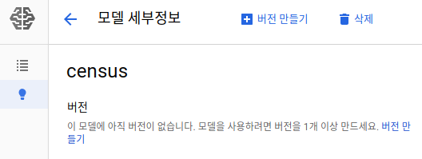
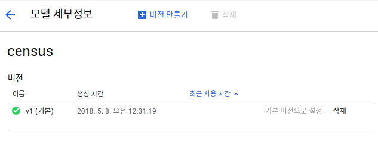

[TOC]

# Overview 

1. Cloud ML은 TensorFlow application을 **클라우드 환경에서 학습**할 수 있도록 도와 둡니다.
2. 학습이 끝난 모델은 바로 Inference를 하도록 클라우드 환경에 호스트시킵니다. 


# Tutorial

## Requirements

```bash
pip3 install --upgrade google-api-python-client oauth2client
```

gcloud 

```
CLOUDSDK_PYTHON=/usr/bin/python3.5
```


## Clone the example repository

Cloud Shell에서 [repo](https://github.com/GoogleCloudPlatform/cloudml-samples)를 클론시키고 편집하기 위해서 새로운 shell 탭을 엽니다. 

```
cloudshell_open --repo_url "https://github.com/googlecloudplatform/cloudml-samples" --page "editor" --open_in_editor "census/estimator"
```



다음의 위치로 이동을 합니다.

```bash
cd census/estimator
```


## 학습 데이터 받기

학습 데이터는 Google Cloud Storage Bucket에 public 형태로 저장이 되어 있습니다.  또한 해당 데이터는 이미 학습을 위한 전처리가 완료되어 있기 때문에 원본 데이터와는 다릅니다. 

학습 데이터를 다운받은후 다시 Cloud Storage에 올리도록 하겠습니다. 

```bash
mkdir data
gsutil -m cp gs://cloudml-public/census/data/* data/
```

**TRAIN_DATA  그리고 EVAL_DATA 변수를 설정**합니다.

```bash
TRAIN_DATA=$(pwd)/data/adult.data.csv
EVAL_DATA=$(pwd)/data/adult.test.csv
```


## Dependencies 설치하기

```bash
pip install --upgrade tensorflow
```

설치가 제대로 되었는지 `ipython`을 실행시켜서 확인합니다.

```python
import tensorflow as tf
hello = tf.constant('Hello, TensorFlow!')
sess = tf.Session()
print(sess.run(hello))
```


## Local 환경에서 Trainer 개발 및 학습하기

실제 Cloud ML Engine 환경에서 live로 돌려보기전에 유사한 환경에서 돌려보는 것이 중요합니다. 

먼저 **output directory를 설정**합니다.

```bash
MODEL_DIR=output
```

아래의 명령어는 training job을 local에서 실행을 시킵니다. 

```bash
gcloud ml-engine local train \
    --module-name trainer.task \
    --package-path trainer/ \
    --job-dir $MODEL_DIR \
    -- \
    --train-files $TRAIN_DATA \
    --eval-files $EVAL_DATA \
    --train-steps 1000 \
    --eval-steps 100
```


## TensorBoard에서 training 확인하기 

output디렉토리를 확인하면 model checkpoints 그리고 summary information이 생성되어 있는 것을 확인할 수 있습니다.  TensorBoard를 통해서 학습과정을 확인 할 수 있습니다. 

```
tensorboard --logdir=output --port=8080
```

8080포트를 통해서 웹을 통해서 확인 할 수 있습니다 .






## Local에서 Prediction 해보기

Tensorflow Model을 학습한뒤, prediction을 해 볼 수 있습니다.  `output/export/census` 디렉토리를 보면 **최종 학습 완료된 모델이 timestamp subdirectory 아래에 저장**되어 있습니다. 

> `output/export/census/1525698067/` 위치는 timestamp에 따라서 변경됩니다. 

```bash
gcloud ml-engine local predict --model-dir output/export/census/1525698067/ --json-instances ../test.json
```

결과값.

```
CLASS_IDS  CLASSES  LOGISTIC         LOGITS          PROBABILITIES
[0]        [u'0']   [0.06806272268]  [-2.616835832]  [0.9319372773, 0.06806272268]
```


## Cloud에서 Training 시키기

Cloud ML Engine은 데이터를 읽고 쓰기 위해서 Google Cloud Storage (GCS)를 access 권한이 있어야 합니다. 

다음과 같은 variables을 설정합니다. 

```bash
PROJECT_ID=$(gcloud config list project --format "value(core.project)")
BUCKET_NAME=${PROJECT_ID}-mlengine
REGION=us-central1
```

GCS에 새로운 bucket을 만듭니다. 

```bash
gsutil mb -l $REGION gs://$BUCKET_NAME
```

데이터를 업로드 하고, TRAIN_DATA 그리고 EVAL_DATA 변수를 새로 설정합니다. 

```bash
gsutil cp -r data gs://$BUCKET_NAME/data
TRAIN_DATA=gs://$BUCKET_NAME/data/adult.data.csv
EVAL_DATA=gs://$BUCKET_NAME/data/adult.test.csv
```


## Cloud에서 Single-instance Trainer 실행시키기

Local환경에서 학습 그리고 예측이 잘 돌아가는것을 확인했습니다. 이제 cloud환경에서 training job을 실행시킬 준비가 되었습니다. 

>예제에서는 single instance를 사용하지만, distributed training 또는 GPU를 사용하는 방법등등 모두 손쉽게 실행할 수 있습니다. 

먼저 다음과 같이 변수들을 설정합니다.

```bash
JOB_NAME=census1
OUTPUT_PATH=gs://$BUCKET_NAME/$JOB_NAME
echo $OUTPUT_PATH
```

클라우드로 job를 전송합니다. 

```bash
gcloud ml-engine jobs submit training $JOB_NAME \
--job-dir $OUTPUT_PATH \
--runtime-version 1.4 \
--module-name trainer.task \
--package-path trainer/ \
--region $REGION \
-- \
--train-files $TRAIN_DATA \
--eval-files $EVAL_DATA \
--train-steps 5000 \
--verbosity DEBUG
```

다음의 명령어로 training job에 대한 progress를 로그로 확인할 수 있습니다.

```bash
gcloud ml-engine jobs stream-logs $JOB_NAME
```


Cloud Machine Learning Engine에서 실행되고 있는 job을 확인할 수 있습니다. 



Google Cloud Storage에 저장된 결과값을 확인합니다.

```bash
gsutil ls -r $OUTPUT_PATH
```

TensorBoard에서 결과값을 확인합니다.

```bash
tensorboard --logdir=$OUTPUT_PATH --port=8080
```


## Deploy your Model to serve prediction requests

Cloud Machine Learning Engine에 학습된 모델을 디플로이하면, prediction requests를 처리할수 있으며, scalable serving이 가능해집니다.

일단은 training job이 완료될때까지 기다려야 합니다. 작업 ID옆에 녹색 체크박스가 표시되거나 또는 "Job completed successfully"를 보게되면 디플로이준비가 완료된것이라고 볼 수 있습니다. 

> 반드시 클라우드에서 학습한 모델을 사용할 필요는 없습니다.  Local 환경에서 학습이 완료된 모델을 디플로이도 가능합니다. 

먼저 Cloud ML Engine에 모델을 생성합니다.

```bash
MODEL_NAME=census
gcloud ml-engine models create $MODEL_NAME --regions=$REGION
```

콜솔에서 생성된 모델을 확인할 수 있습니다.



최종 생성된 모델의 위치를 찾습니다. (timestamp로 디렉토리가 생성되기 때문에 반드시 필요합니다.)

```bash
gsutil ls -r $OUTPUT_PATH/export
```

Timestamp를 확인해서 변수를 생성합니다.

```bash
MODEL_BINARIES=$OUTPUT_PATH/export/census/<timestamp>/
```


디플로이를 합니다.

```bash
gcloud ml-engine versions create v1 \
--model $MODEL_NAME \
--origin $MODEL_BINARIES \
--runtime-version 1.4
```

디플로이는 완료되기까지 실제로 몇분이상이 걸립니다. 

최종 디플로이된 모델에 대한 확인은 다음과 같이 합니다.

```bash
gcloud ml-engine models list
```

콘솔에서 확인내용은 다음과 같습니다. 



Prediction request를 다음과 같이 보내서 테스트할 수 있습니다. 

```bash
gcloud ml-engine predict \
--model $MODEL_NAME \
--version v1 \
--json-instances ../test.json
```

결과값은 다음과 같습니다.

```
CLASS_IDS  CLASSES  LOGISTIC         LOGITS            PROBABILITIES
[0]        [u'0']   [0.03047093376]  [-3.46003723144]  [0.96952909231, 0.030470931902]
```

