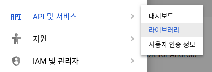
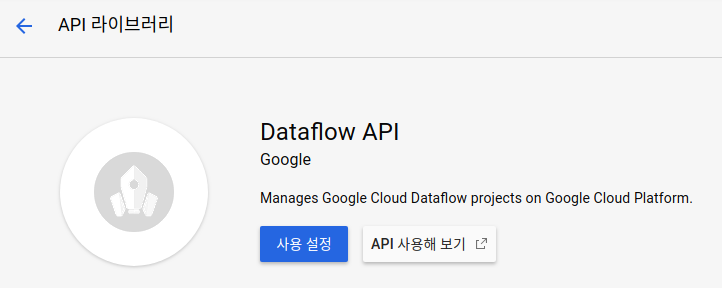
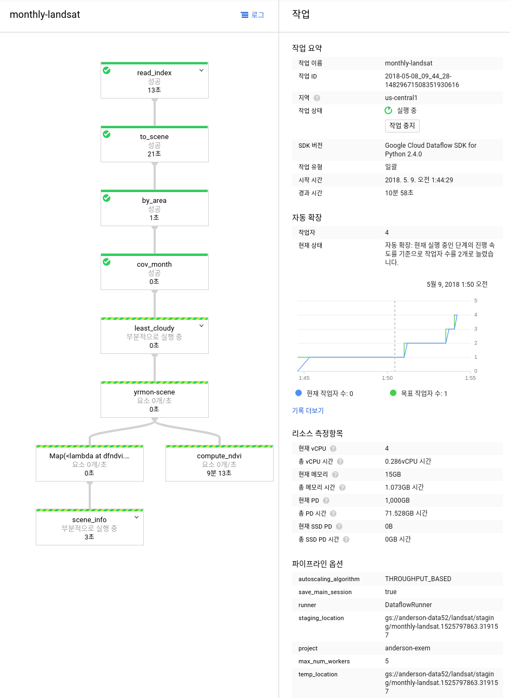

[TOC]

# Overview

해당 튜토리얼에서는 Apache Beam 그리고 Cloud Dataflow를 사용해서 [Landsat data](https://cloud.google.com/storage/docs/public-datasets/landsat)를 처리하도록 하겠습니다. 

Landsat data는 GCP에서 public dataset으로 제공을 하고 있습니다.  일반적으로 Landsat images는 농업에서 vegetation index (식생지수: 녹생식물의 상대적 분포량과 활동성 등등을 포함하는 지표)를 만드는데 사용이 됩니다.  월별vegetation index를 만들기 위해서는 다음과 같은 일을 처리하는 스크립트가 필요 합니다. 

1. 알고자 하는 지역의 Landsat Images를 찾는다
2. 이중에서 가장 구름이 안낀 사진을 월별로 찾는다
3. 각각의 이미지는 인공위성의 종류에 따라, 밴드 3과 4 또는 4와 5사이의 정규화된 차이 (normalized difference)를 계산해야 합니다. 이것을 NDVI (Normalized Difference Vegetation Index)라고 합니다. 

이런 일을 처리하기 위해서 Python 스크립트를 만들수 있을 것입니다. 문제는 여러대의 머신에서 fault-torelent로 동시다발적으로 일을 처리하는 것은 매우 어렵습니다. 이때 사용할수 있는 것이 바로 Google Cloud Dataflow입니다. 

>Google Cloud Dataflow는 구글의 proprietary managed service로서 스트리밍 그리고 배치데이터를 파이프라인을 통해 처리를 할 수 있습니다. Programming model 그리고 SDK는 Apache Beam을 통해서 오픈소스화 되었습니다.  자세한 내용은 [링크](https://cloudplatform.googleblog.com/2016/01/Dataflow-and-open-source-proposal-to-join-the-Apache-Incubator.html?m=1)를 확인합니다. 


# Tutorial

## Enable Dataflow API 

먼저 `제품및 서비스` > `API 및 서비스` > `라이브러리` 를 선택합니다.



검색창에서 `dataflow`를 검색후 서택한후 `사용설정 `버튼을 누릅니다. 



`API 사용 설정`이 되면 외부에서 해당 API를 사용할수 있게 됩니다. 


## Beam code를 Dataflow runner로 보내기

먼저 튜토리얼에 사용할 코드를 클론합니다. 

```bash
git clone https://github.com/GoogleCloudPlatform/training-data-analyst
cd training-data-analyst/blogs/landsat
```

튜토리얼에 필요한 패키지를 설치합니다.

```bash
cd ~/training-data-analyst/blogs/landsat/
yes | sudo ./install_packages.sh
```


`gsutil mb` 명령어를 통해서 Google Cloud Storage에 bucket을 새로 만듭니다.
(이미 있으면 만들필요 당연히 없습니다.)

```bash
gsutil mb gs://your-unique-bucket-name
```

`nano run_oncloud.sh` 파일을 열고 `max_num_workers=10`  에서 5로 변경합니다. 


다음을 실행하여 클라우드에서 코드를 실행하도록 합니다. 

```bash
./run_oncloud.sh <PROJECT> <BUCKET>
```

`run_oncloud.sh` 파일에는 다음과 같은 내용이 있습니다.

```bash
#!/bin/bash
if [ "$#" -ne 2 ]; then
   echo "Usage:   ./run_oncloud.sh project-name  bucket-name"
   echo "Example: ./run_oncloud.sh cloud-training-demos  cloud-training-demos"
   exit
fi
PROJECT=$1
BUCKET=$2
gsutil -m rm -rf gs://$BUCKET/landsat/output
python ./dfndvi.py \
    --project=$PROJECT \
    --runner=DataflowRunner \
    --staging_location=gs://$BUCKET/landsat/staging \
    --temp_location=gs://$BUCKET/landsat/staging \
    --index_file=gs://cloud-training-demos/landsat/2015index.txt.gz \
    --max_num_workers=5 \
    --autoscaling_algorithm=THROUGHPUT_BASED \
    --output_file=gs://$BUCKET/landsat/output/scenes.txt \
    --output_dir=gs://$BUCKET/landsat/output \
    --job_name=monthly-landsat \
    --save_main_session \
    --setup_file=./setup.py
```


## Dataflow Job 확인하기

Dataflow 메뉴를 누르면 새롭게 업로드된 job을 확인할 수 있습니다. 

오른쪽 `작업`화면에서 max_num_workers를 확인해보면 5로 되어 있는것을 확인할 수 있습니다 .




약 10~12분정도 걸려서 job이 완료가 되면 Bucket에 가서 결과물을 확인할 수 있습니다. 

